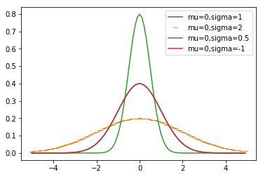

# Lab 2
Contents
```
-friends.ipynb

-normal_df.ipynb
-normal_df.png
```

# Part 1
Sample Output using the following array:
num_friends=[100, 49, 41, 40, 25, 10, 5, 4, 7, 20, 60]
```
Mean is: 32.81
Median is 25
```

# Part II
## Plot from normal_df.py

